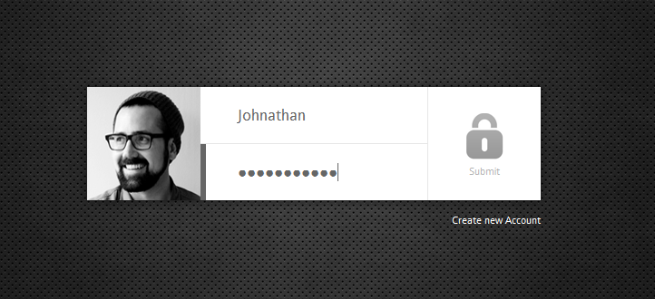
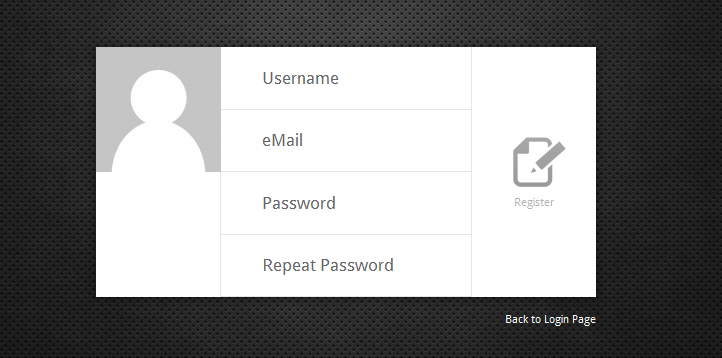

# php-login-styles

*This is just a placeholder, the project will start in early 2014.*

Beautiful user interfaces / themes / templates for the different version of the php-login project. Find the php-login
project portal site here: http://www.php-login.net and the 4 versions here:

1. **One-file version:** Full login script in one file. Uses a one-file SQLite database (no MySQL needed) and PDO.
   Features: Register, login, logout.
   https://github.com/panique/php-login-one-file
2. **Minimal version** All the basic functions in a clean file structure, uses MySQL and mysqli.
   Register, login, logout.
   https://github.com/panique/php-login-minimal
3. **Advanced version** Similar to the minimal version, but full of features.
   Uses PDO, Captchas, mail sending via SMTP and much more.
   https://github.com/panique/php-login-advanced
3. **Professional version** Everything comes with a professional MVC framework structure, perfect for building
   real applications. Additional features like: URL rewriting, professional usage of controllers and actions, PDO, MySQL,
   mail sending via PHPMailer (SMTP or PHP's mail() function/linux sendmail), user profile pages, public user profiles,
   gravatars and local avatars, account upgrade/downgrade etc., login via Facebook, Composer integration, etc.
   https://github.com/panique/php-login

## Some short previews:

## Project stats

